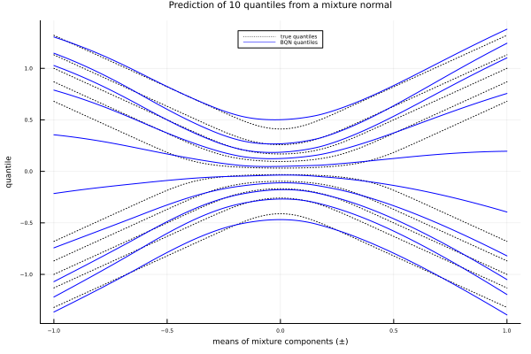

##  Conditional Gaussian mixtures

In this demonstration, simulated data from a conditional mixture of two normal distributions is used to train a Bernstein Quantile Network model. The training data is generated as follows
```
    μ ~ Uniform(-1, 1)
    Y ~ Normal(μ, 0.25^2)/2 + Normal(-μ, 0.25^2)/2 
```   
Here, μ will serve as the single input feature, while Y is the target variable. Hence, the objective is for the Bernstein Quantile Network to learn the underlying distribution of Y conditioned on the input μ.


The Julia code is as follows

```julia
using BQNet, Flux, MLUtils, Random, Distributions, Plots

#  define mixture model
mixture(m, sd) = MixtureModel([Normal(m, sd), Normal(-m, sd)])

#  function for generating data
function create_data(; n = 50_000, sd = 0.25)
    x = Float32.(rand(Uniform(-1, 1), n))
    y = map(m -> rand(mixture(m,sd), 1)[1], x)
    return reshape(x, 1, :), Float32.(y)
end

#  create data
Random.seed!(1234)
n = 20_000
x, y = create_data(n = n)

#  create data loaders for training and validation
idx = Int(round(0.9 * n))
ktr = 1:idx
kval = idx+1:n
train_loader = DataLoader((x[:, ktr], y[ktr]), batchsize = 250,
                               shuffle = true, partial = false)
val_loader   = DataLoader((x[:, kval], y[kval]), batchsize = length(kval))


#  create and train model
device = cpu
degree = 12
model  = Chain(Dense(size(x,1), 32, elu),
               Dense(32, 32, elu),
               Dense(32, degree+1), softplus_bqn) |> device

@time model_fit = bqn_train!(model, train_loader, val_loader; device = device)


#  make predictions of quantiles 
prob_out = 0.05:0.1:0.95
xp = Float32.(transpose(-1:0.01:1))
qts_true = [quantile(mixture(x, 0.25), prob_out) for x in xp[:]]
qts_true = Float32.(reduce(hcat, qts_true))
fit_qts  = predict(model_fit, xp; prob = prob_out)


#  plot true and fitted distributions
plot(u, qts_true', color = :black, linestyle = :dot,
     legend = :top, label = reshape(["true quantiles"; fill("", 9)], 1, 10),
     title = "Prediction of $(length(prob_out)) quantiles from a mixture normal",
     xlab = "means of mixture components (±)", ylab = "quantile")
plot!(u, fit_qts', color = :blue,
      label = reshape(["BQN quantiles"; fill("", 9)], 1, 10))
```
The code will produce the following plot



Note that the BQN model has not been tuned. Hence, better fits should be possible by exploring other network configurations and hyper-parameters including the degree of the Bernstein polynomial.

